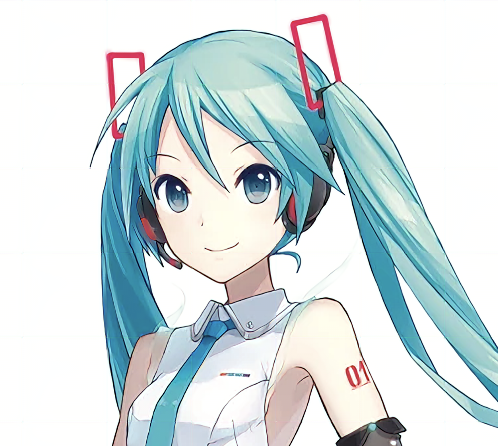
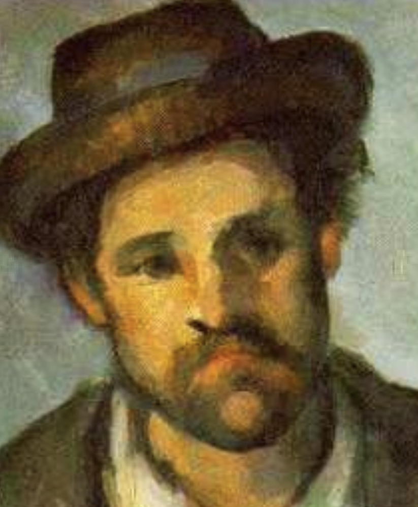
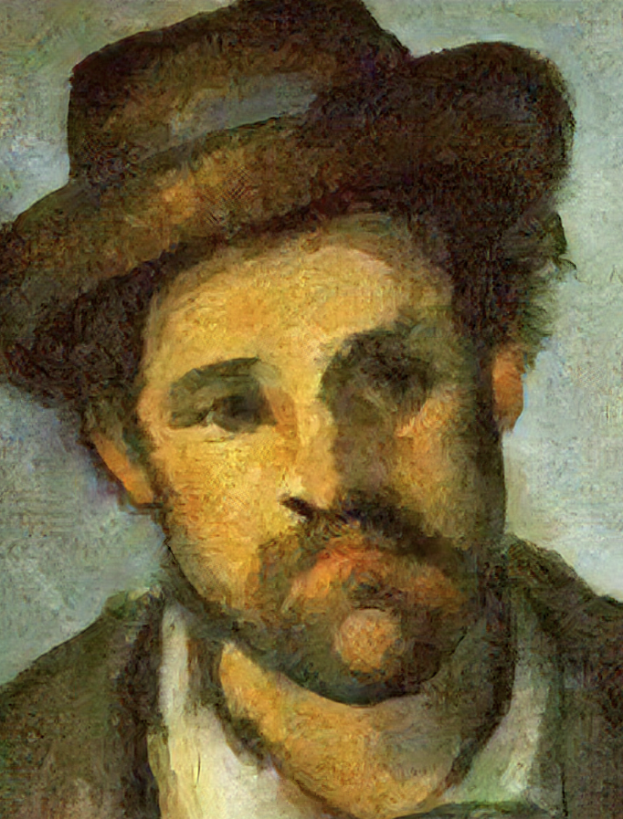

# Yet Another Anime Upscaler

YAAU is a list of model to upscale images, trained using perceptual loss.

Following fastai course on super resolution with perceptual loss 
(https://github.com/fastai/course-v3/blob/master/nbs/dl1/lesson7-superres.ipynb), 
I wondered if using custom classifier with a VGG architecture could improve the result.

This repository contains several perceptual loss model, 
trained on different corpus, and with different classifiers.

It also provide a generic python script to use such upscalers in a generic way, with images of any size.

# Repository organisation
|
|- nb: notebooks that contains the training code
|  |- painting: a model trained on https://www.kaggle.com/ikarus777/best-artworks-of-all-time
|  |- danbooru: a model trained on a subset of Danbooru
|- yauu: the python code that will upscale wholes images

# Usage:

two pretrained network are provided:

* super_res_painting.pth trained on paintings
* super_res_danbooru.pth trained

you can find these models here: https://mega.nz/folder/GQNDmYjQ#D6wMag7n_7LczJJtP-KQdQ

for the time being, you will need to edit super_res.py to use the right model.

`python super_res.py <image_path`

The result will then be in result.png
# train your own model
A perceptual loss model is trained in 2 stages

## the classifier

you need to train a classifier on the data. You will need to find a meaningful classification.
 For Danbooru, i trained the classifier on the rating (Q/E/S). For the painting, it was trained to classify by artist.
The classifier needs to use a vgg architecture.

## the upscaler

The upscaler is a U network with a resnet34 encoder. 
It is trained in a progressive way from very small image to bigger ones.
You can use the scripts in yauu/training to train your own
  

# Examples

## Danbooru
A lot of thanks to Gwern for hosting such an incredible resource.
Original picture:


upscaled with perceptual loss model:


## Paintings
Original:



Upscaled



## Installation
you will need poetry. `./init_env.sh` will install dependencies.
if you want to train the model yourself, you will need danbooru, or at least a part of it.
If you want to use a pretrained model, you can download it in the releases.

```
## Usage
`python ./super_res.py <image>`
 