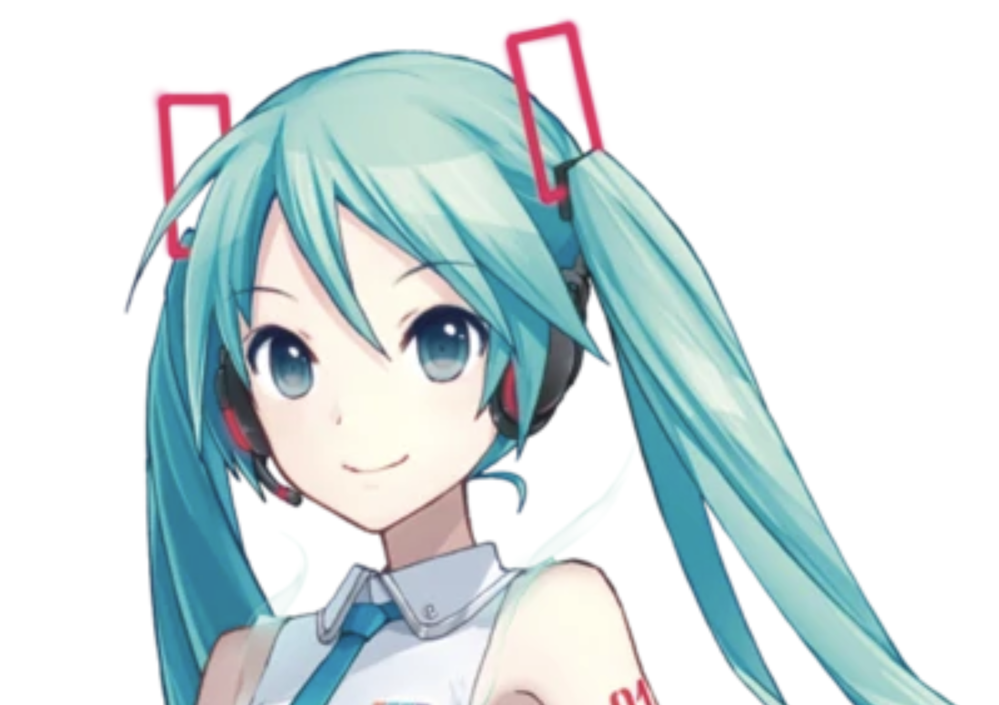
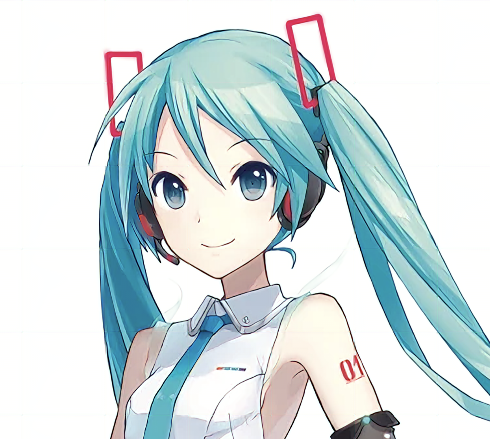

# Yet Another Anime Upscaler

YAAU is a model to upscale images, trained on Danbooru.
A lot of thanks to Gwern for hosting such an incredible resource.


## Installation

you will need poetry. `./init_env.sh` will install dependencies.
if you want to train the model yourself, you will need danbooru, or at least a part of it.
If you want to use a pretrained model, you can download it in the releases.

```
## Usage
`python ./super_res.py <source>`
